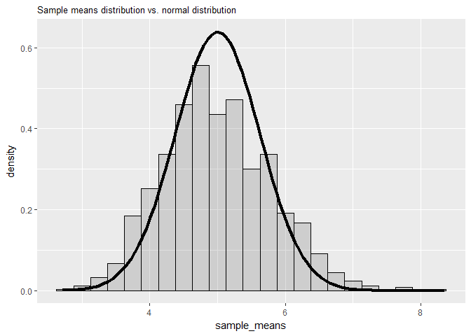

***
In this project, we will investigate the exponential distribution in R and compare our results with the results expected according to the central limit theorem.

## Central Limit Theorem

The central limit theorem (CLT) states that if you have a population with mean $μ$ and standard deviation $σ$ and take sufficiently large random samples (usually $n$ > 30) from the population with replacement, then the distribution of the sample means will be approximately **normally distributed** with a mean of $μ$ and a variance of $σ^{2}/n$.

Our population will be the exponential distribution and thus has a mean of $1/\lambda$ and a variance of $(1/\lambda)^{2}$. For the purpose of our study, we will run 1,000 simulations and, each time, calculate the mean of 40 random samples drawn from our population. According to the CLT, we expect the distribution of our sample means to be approximately normally distributed with a mean of $1/\lambda$ and a variance of $(1/\lambda)^{2}/n$.

## Simulation

### Running the simulation

We perform 1,000 simulations and, each time, calculate the mean of 40 random samples.

```r
nosim <- 1000
n <- 40
lambda <- 0.2

dat <- data.frame(sapply(1:nosim, function(i) mean(rexp(n, lambda))))
names(dat) <- "sample_means"
head(dat)
```

```
##   sample_means
## 1     4.284896
## 2     6.127672
## 3     5.853809
## 4     5.426770
## 5     4.526934
## 6     4.268907
```

### What is the sample mean and how does it compare to the theoretical mean?

According to the CLT, the sample means should converge towards a mean of $1/\lambda$. Let us verify this.

```r
sampleMean <- mean(dat$sample_means)
sampleMean
```

```
## [1] 4.998138
```

```r
theoreticalMean <- 1/lambda
theoreticalMean
```

```
## [1] 5
```
We see that the sample mean is quite close to the theoretical mean we were expecting.

### What is the sample variance and how does it compare to the theoretical variance?

According to the CLT, the sample means should converge towards a variance of  $(1/\lambda)^{2}/n$. Let us verify this.

```r
sampleVar <- var(dat$sample_means)
sampleVar
```

```
## [1] 0.6462347
```

```r
theoreticalVar <- (1/lambda)^2*1/n
theoreticalVar
```

```
## [1] 0.625
```
We see that the sample variance is quite close to the theoretical variance we were expecting.

### Is the sample means distribution approximately normal?

According to the CLT, we would expect our sample means to be nornally distributed, i.e. display a bell-shaped distribution centered around the mean of the distribution. Let us verify this in a plot, whereby we will plot: 

* A histogram showing how our sample means are distributed; and
* The probability density function of the normal distribution with a mean of $1/\lambda$ and a variance of $(1/\lambda)^{2}/n$.


```r
library(ggplot2)
g <- ggplot(dat, aes(sample_means)) + geom_histogram(alpha = .20, binwidth=.25, colour = "black", aes(y = ..density..))
g <- g + stat_function(fun = dnorm, args = list(mean = 1/lambda, sd = (1/lambda)^2*1/n), size = 1.5, colour = "black")
g <- g + labs(subtitle = "Sample means distribution vs. normal distribution")
g
```

<!-- -->
